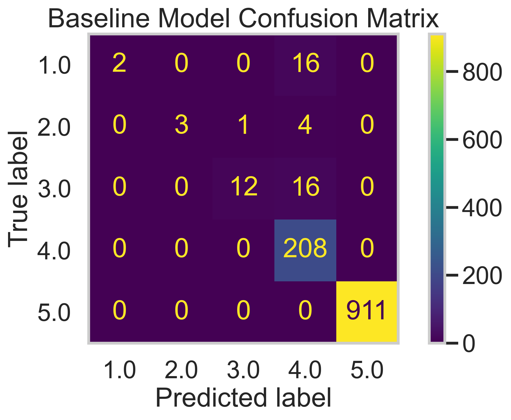
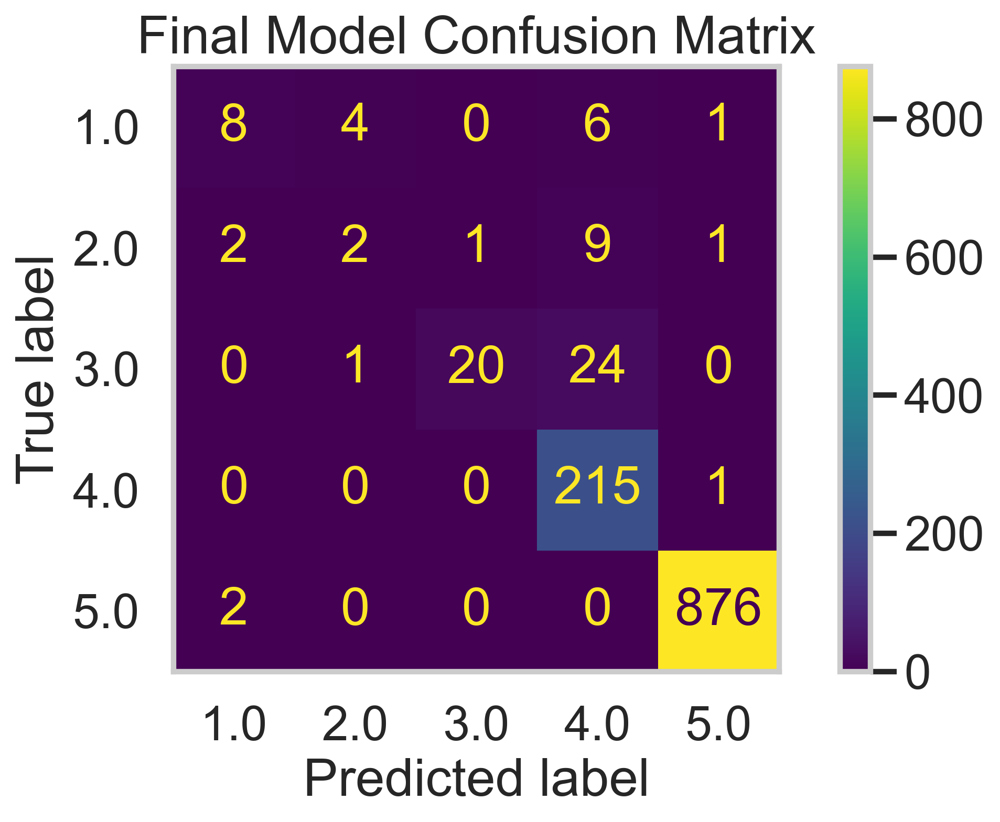

# Recipes and Ratings: Total Fat Content and Recipe Ratings
**By: Mihir Vad**

---

## Introduction

This project analyzes recipe and review data from Food.com to explore and model what influences a recipe’s rating. The goal is to predict a recipe's rating based on its ingredients, review, and nutritional value.

The motivation behind this question is simple but powerful: can we determine whether total fat content influences how highly a recipe is rated? Given the  online social presence for cooking platforms, this seeks to help users look through healthy eating options.

Datasets Used:

### 1. Recipes Dataset (83,782 entries)

| Column           | Description                                                                                                                                     |
|------------------|-------------------------------------------------------------------------------------------------------------------------------------------------|
| `name`           | Recipe Name                                                                                                                                     |
| `id`             | Recipe ID                                                                                                                                       |
| `minutes`        | Time to Prepare Recipe in Minutes                                                                                                               |
| `contributor_id` | User ID for Recipe Uploader                                                                                                                     |
| `submitted`      | Date of Recipe Submission                                                                                                                       |
| `tags`           | Food.com Tags for Recipe                                                                                                                        |
| `nutrition`      | List of Nutrition Info in the form `[calories (#), total fat (PDV), sugar (PDV), sodium (PDV), protein (PDV), saturated fat (PDV), carbs (PDV)]` |
| `n_steps`        | Total Steps in a Recipe                                                                                                                         |
| `steps`          | Recipe Steps, in Order                                                                                                                          |
| `description`    | User-Provided Description                                                                                                                       |

### 2. Interaction Dataset (Reviews) (731,927 entries)

| Column      | Description        |
|-------------|--------------------|
| `user_id`   | User ID            |
| `recipe_id` | Recipe ID          |
| `date`      | Date of Review     |
| `rating`    | Rating             |
| `review`    | Review Text        |

After merging, the combined dataset contains 234,429 rows of recipes with corresponding reviews and ratings. The columns I mainly focused on were total fat (PDV) and rating for the question: 

### Does the total fat content of a recipe relate to how highly it’s rated by users?

We also explore this relationship through hypothesis testing and a predictive model that estimates a recipe’s rating based on its fat content and other features.

---

## Data Cleaning and Exploratory Data Analysis

We performed the following steps to clean and prepare our data:

- Merged the recipes and reviews datasets on `recipe ID`.
- Removed invalid ratings (replaced `0` with `NaN`) and computed each recipe’s average rating.
- Extracted nutrition values into separate columns like `calories (#)`, `total fat (PDV)`, etc.
- Converted stringified lists into real Python lists for `tags`, `steps`, and `ingredients`.
- Dropped outliers with `calories > 1500` or `cook time > 360 minutes (6 hours)`.
- Engineered new features like `n_ingredients` and dropped irrelevant columns.

Here’s a snapshot of the cleaned dataset:

| calories (#) | total fat (PDV) | minutes | rating | n_ingredients |
|--------------|------------------|---------|--------|----------------|
| 138.4        | 10               | 40      | 4      | 9              |
| 595.1        | 46               | 45      | 5      | 11             |
| 194.8        | 20               | 40      | 5      | 9              |
| 194.8        | 20               | 40      | 5      | 9              |
| 194.8        | 20               | 40      | 5      | 9              |

This cleaning reduced noise and resulted in a cleaner, structured dataset with 220,373 rows.

### Univariate Analysis: Distribution of Total Fat

<iframe src="assets/tot_fat_dist.html" width="820" height="500" frameborder="0"></iframe>

We first examined the distribution of total fat across all recipes. Most recipes have a fat content between 10%–30% of the daily recommended value, with a steep drop-off afterward. A long right tail suggests a smaller subset of high-fat recipes. The distribtion is highly skewed to the right.

### Bivariate Analysis: Relationship between Total Fat and Mean Recipe Rating

<iframe src="assets/totalfatandmeanreciperating.html" width="820" height="400" frameborder="0"></iframe>

Next, we looked at the relationship between total fat and the mean recipe rating. Despite some noise, there appears to be a loose cluster of high-fat recipes receiving high ratings, but overall, the correlation is weak. This suggests that while fat content may contribute to taste, it's not the sole factor driving user ratings.

### Interesting Aggregates: Pivot Table: Fat Content by Recipe Rating

We grouped recipes by their user ratings to analyze whether higher-rated recipes tend to have more or less fat content and longer preparation time.
Here is a snapshot of my pivot table:

|   fat_rounded |    mean |   median |   min |   max |
|--------------:|--------:|---------:|------:|------:|
|             0 | 4.69013 |  4.91667 |     1 |     5 |
|             5 | 4.65141 |  4.83333 |     1 |     5 |
|            10 | 4.6696  |  4.83333 |     1 |     5 |
|            15 | 4.68125 |  4.875   |     1 |     5 |
|            20 | 4.69273 |  4.86667 |     1 |     5 |

#### Trends of the Pivot Table

<iframe src="assets/pivottabletrends.html" width="820" height="500" frameborder="0"></iframe>

This line plot reveals a few important patterns:

- **Mean and median ratings stay high and stable** across most fat levels, suggesting users rate most recipes positively regardless of fat content.
- However, the **minimum rating fluctuates wildly** — especially at high fat levels — indicating that while many high-fat recipes are loved, they are also more divisive.
- There’s a consistent **cluster of low-rated recipes below 100% DV** of fat, suggesting low-fat recipes may underperform in user satisfaction more often than others.

This aggregation helped shape our hypothesis: *Does fat content actually affect how a recipe is rated?* The variability in min ratings suggested a possible direction for deeper statistical testing.

---

## Assessment of Missingness

### NMAR Analysis

We believe the `rating` column is **Not Missing At Random (NMAR)**. The missingness is likely tied to the **perceived value the recipe itself** — for example, extremely simple or popular recipes may not get reviews because users feel there's nothing new to add. This makes the missingness dependent on a user internal reasoning, not by an observable value in the dataset. Since this decision depends on the value itself, we classify `rating` as NMAR.

To reclassify it as MAR, we would need an external feature such as user behavior logs to measure how well a user interacts with the recipes, which we do not have.

### Permutation Tests: Is `rating` Missingness Dependent?

We tested whether the missingness in the `rating` column depends on other observed features by conducting permutation tests. Specifically, we tested for dependency on `total fat (PDV)` and `minutes`.

#### Rating Missingness vs Total Fat:

**Null Hypothesis**: Missingness in `rating` is independent of `total fat (PDV)`  
**Alternative Hypothesis**: Missingness in `rating` depends on `total fat (PDV)`

- **Observed Statistic**: 5.7406  
- **P-value**: 0.0000

Below we show the permutation distribution of total fat and the missingness of rating:
<iframe src="assets/missingness_tf.html" width="820" height="500" frameborder="0"></iframe>

**Conclusion**: The result is statistically significant, so we reject the null hypothesis. This suggests that **recipes with very high or very low fat content may be more or less likely to receive a rating**, implying the missingness is **MAR** on `total fat (PDV)`.

#### Rating Missingness vs Minutes:

**Null Hypothesis**: Missingness in `rating` is independent of `minutes`  
**Alternative Hypothesis**: Missingness in `rating` depends on `minutes`

- **Observed Statistic**: 51.4524  
- **P-value**: 0.1170

Below we show the permutation distribution of minutes and the missingness of rating:
<iframe src="assets/missingness_minutes.html" width="820" height="500" frameborder="0"></iframe>

**Conclusion**: The result is not statistically significant, so we fail to reject the null. This fails to supports that **rating missingness is due to cooking time** (`minutes`), meaning people don’t forget to rate just because the recipe took longer.

These results provide important context for modeling, especially since it's not missing completely at random.

---

## Hypothesis Testing

We investigated whether **low-rated recipes tend to have more fat** than high-rated ones.

### Research Question  
> Does the total fat content of a recipe relate to how highly it’s rated by users?

### Hypotheses
- **Null Hypothesis (H₀):** There is no difference in total fat content between low-rated (≤3 stars) and high-rated (>3 stars) recipes.
- **Alternative Hypothesis (H₁):** Low-rated recipes tend to have **higher** total fat content than high-rated recipes.

### Test Statistic  
We used the **difference in mean total fat content** (low - high) as our test statistic. To assess significance, we performed a **permutation test** with 1000 shuffles.

### Results  
- **Observed Statistic**: 0.5002  
- **P-value**: 0.0200  
- **Significance Level (α)**: 0.05  

Below we show the result of the permutation test of total fat by rating group:
<iframe src="assets/total_fat_byrating_group.html" width="820" height="500" frameborder="0"></iframe>

### Conclusion  
Since the p-value is below 0.05, we **reject the null hypothesis**. This provides **statistical evidence** that low-rated recipes tend to have slightly higher fat content than high-rated ones. While the relationship is subtle, the result suggests the idea that excessive fat might negatively impact user satisfaction.

---

## Framing a Prediction Problem

We aim to predict a recipe’s user rating based on its features, including ingredients, nutrition info, and reviews. This is a **multiclass classification** problem, where the response variable is the `rating` (1–5). We chose this because rating reflects user satisfaction and ties directly to our project’s central question. It also allows us to explore how recipe characteristics influence user preferences.

To evaluate our model, we use the **macro-averaged F1 score** instead of accuracy. This is because our class distribution is imbalanced — most ratings are 4s and 5s. F1 macro equally weighs each class and gives better insight into underrepresented ratings. It’s a more fair and informative metric for this use case.

At prediction time, we only include features known when a recipe is submitted. This includes ingredients, nutritional data, time to prepare, and user review text. We exclude future-leaking info like average rating to preserve  relevance. This ensures our model makes fair predictions without cheating with future data.

---

## Baseline Model

To establish a strong starting point for our prediction task, we trained a baseline model using two categorical features: the highest TF-IDF word found in a recipe’s ingredient list and the highest TF-IDF word from its review text. These two features summarize textual input into interpretable signals. We sampled 5,000 rows to reduce memory strain and excluded rows with missing reviews or ratings.

Both TF-IDF features are **nominal categorical variables**, and we encoded them using **One-Hot Encoding** inside a `ColumnTransformer`. These transformations were wrapped in a full `Pipeline` with a `RandomForestClassifier`. This pipeline ensured consistency and reproducibility during training and evaluation.

We evaluated the model using the **macro-averaged F1 score** to account for class imbalance. Our baseline model achieved a score of **0.6986**, suggesting decent performance on a challenging multiclass task. The confusion matrix below shows that the model is best at predicting 4- and 5-star ratings, but performs poorly on lower ones.

<figure markdown>
  
  <figcaption align="center">Confusion matrix of the baseline model predictions</figcaption>
</figure>

---

## Final Model

To improve our predictions from the baseline model, we engineered two new quantitative features: `fat_calorie_ratio`, which measures how much fat a recipe contains per calorie, and `minutes_per_step`, which captures the complexity of a recipe’s instructions. These features aim to reflect how dense or time-intensive a recipe is—important aspects that may influence how users rate recipes. We kept our TF-IDF based ingredient and review features and added numeric transformations using `StandardScaler`, plus threshold-based binarizations for step and ingredient counts.

Our final model used a `RandomForestClassifier`, selected for its ability to capture nonlinear interactions in the data without requiring heavy preprocessing. We used `GridSearchCV` to tune hyperparameters like the number of estimators, max tree depth, minimum samples per split, and class weight. These were chosen to explore the trade-offs between overfitting and underfitting, and to account for possible class imbalances in rating distributions.

To optimize our final model, we performed a grid search over several key hyperparameters of the RandomForestClassifier. We tuned n_estimators, which determines the number of trees in the forest, testing values of 100 and 200 to balance performance and training time. We adjusted max_depth to control the complexity of each tree, trying values of 20 and 30 to prevent both overfitting and underfitting. Additionally, we experimented with min_samples_split values of 2 and 5, which set the minimum number of samples needed to split an internal node — higher values can mitigate overfitting. Finally, we tested class_weight settings of None and 'balanced' to address potential class imbalance in the ratings. These hyperparameters were chosen because they directly impact model flexibility, generalization, and fairness across classes.

The best performing model achieved a **macro F1 score of 0.7446**, outperforming the baseline’s 0.6986. This suggests the new features may have provided more predictive power and improved generalization, though further validation would be needed to confirm this across broader datasets. Below is the confusion matrix for our final model’s predictions, showing improved performance especially in the mid-to-high rating range.

<figure markdown>
  
  <figcaption align="center">Confusion matrix of the final model predictions</figcaption>
</figure>

---

## Evaluating Model Fairness

We evaluated whether our final model performs fairly across recipes with different calorie levels. Specifically, we compared the model’s **macro precision** for:

- **Group X:** Low-calorie recipes (≤ 1000 calories)  
- **Group Y:** High-calorie recipes (> 1000 calories)

We used **macro precision** as our evaluation metric because it evenly weighs performance across all rating classes, making it appropriate for our imbalanced multiclass setting.

### Hypotheses
- **Null Hypothesis (H₀):** There is no difference in macro precision between low- and high-calorie recipes; any observed difference is due to random chance.  
- **Alternative Hypothesis (H₁):** There is a statistically significant difference in macro precision between the two groups.

We ran a permutation test using the **difference in macro precision** (Low – High) as our test statistic, with a significance level of **α = 0.05**.

- **Observed Difference:** **0.1780**  
- **P-value:** **0.6760**  
- **Statistical Significance:** **No**  
- **Conclusion:** We fail to reject the null hypothesis. The precision difference between low- and high-calorie groups is not statistically significant, so we find no evidence of unfairness in model precision based on calorie level.

Below we show a distribution of the fairness permutation:
<iframe src="assets/fairness_permutation_precision.html" width="820" height="500" frameborder="0"></iframe>
